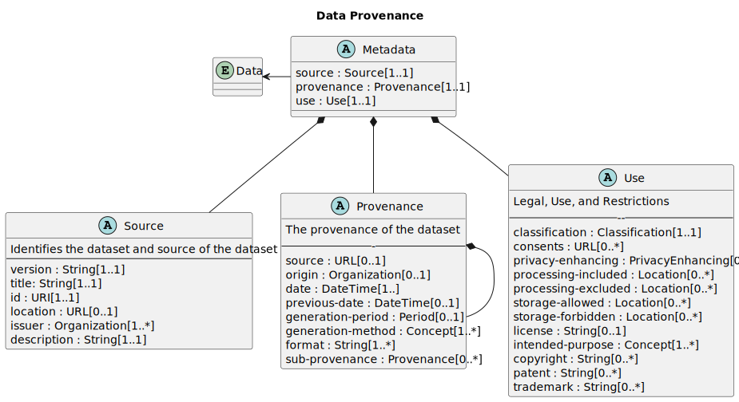

# Provenance Schema {#provenance-schema}

The schema of the provenance metadata is described in human-readable property tables.
The technical encoding may be found in section [sec](#provenance-information-model-encoding).

The Data Provenance Standards record metadata elements in three segmented categories: Source, Provenance, and Use.

The property tables first define metadata about the specification itself,
then describe how a record is made of the 3 primary metadata elements.
The three segmented categories (Source, Provenance, and Use) are comprised of various
metadata element input fields. Each field is described in more detail below.
