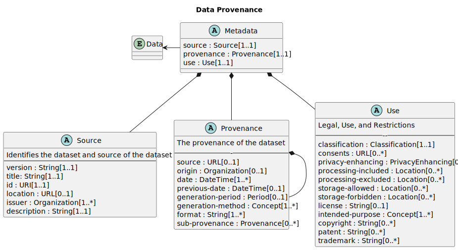

# Data Provenance Metadata Version 1.0

## Committee Specification Draft 01

## 07 May 2026

### This version

- [https://docs.oasis-open.org/dps/prov-meta/v1.0/csd01/prov-meta-v1.0-csd01.md](https://docs.oasis-open.org/dps/prov-meta/v1.0/csd01/prov-meta-v1.0-csd01.md) (Authoritative)
- [https://docs.oasis-open.org/dps/prov-meta/v1.0/csd01/prov-meta-v1.0-csd01.html](https://docs.oasis-open.org/dps/prov-meta/v1.0/csd01/prov-meta-v1.0-csd01.html)
- [https://docs.oasis-open.org/dps/prov-meta/v1.0/csd01/prov-meta-v1.0-csd01.pdf](https://docs.oasis-open.org/dps/prov-meta/v1.0/csd01/prov-meta-v1.0-csd01.pdf)

### Latest version

- [https://docs.oasis-open.org/dps/prov-meta/v1.0/prov-meta-v1.0.md](https://docs.oasis-open.org/dps/prov-meta/v1.0/prov-meta-v1.0.md) (Authoritative)
- [https://docs.oasis-open.org/dps/prov-meta/v1.0/prov-meta-v1.0.html](https://docs.oasis-open.org/dps/prov-meta/v1.0/prov-meta-v1.0.html)
- [https://docs.oasis-open.org/dps/prov-meta/v1.0/prov-meta-v1.0.pdf](https://docs.oasis-open.org/dps/prov-meta/v1.0/prov-meta-v1.0.pdf)

### Previous version

N/A

### Technical Committee

[Data Provenance Standard Technical Committee](https://groups.oasis-open.org/communities/tc-community-home2?CommunityKey=2c60b2cf-45d3-48cd-8594-0194f182b33d)

### Chairs

- Lisa Bobbitt, Cisco, lbobbitt@cisco.com
- Bryan Bortnick, IBM, bortnick@us.ibm.com
- Fotis Psallidas, Microsoft, Fotis.Psallidas@microsoft.com

### Secretaries

- Jamie Yu, Cisco, jamyu2@cisco.com

### Editors

- David Kemp, NSA, d.kemp@cyber.nsa.gov
- Stefan Hagen, individual, stefan@hagen.link

### Additional Artifacts

This prose specification is one component of a Work Product that also includes:

- Data Provenance Metadata JSON schema: https://docs.oasis-open.org/dps/prov-meta/v1.0/csd01/schema/data-provenance.json. \
  Latest stage: https://docs.oasis-open.org/dps/prov-meta/v1.0/schema/data-provenance.json.
- Data Provenance Metadata Configuration JSON schema: https://docs.oasis-open.org/dps/prov-meta/v1.0/csd01/schema/data-provenance-configuration.json. \
  Latest stage: https://docs.oasis-open.org/dps/prov-meta/v1.0/schema/data-provenance-configuration.json.

### Declared JSON namespaces

- <https://docs.oasis-open.org/dps/prov-meta/v1.0/schema/data-provenance.json>
- <https://docs.oasis-open.org/dps/prov-meta/v1.0/schema/data-provenance-configuration.json>

### Abstract

This OASIS Data Provenance Metadata specification provides an information model and several specialized data schemata for describing and managing data provenance and data lineage.
The resulting common language provides transparency for data provenance and enables assessing where data comes from,
how it has been created, and in what scenarios it can be used, legally.

### Citation Format

When referencing this document, the following citation format should be used:

**[prov-meta-v1.0]**

_Data Provenance Metadata Version 1.0_. Edited by David Kemp and Stefan Hagen. 07 May 2026. OASIS Committee Specification Draft 01. \
https://docs.oasis-open.org/dps/prov-meta/v1.0/csd01/prov-meta-v1.0-csd01.html. \
Latest stage: https://docs.oasis-open.org/dps/prov-meta/v1.0/prov-meta-v1.0.html.

### Related Work

This document replaces or supersedes:

N/A

This document is related to:

N/A

## License, Document Status, and Notices

Copyright © OASIS Open 2026.
All Rights Reserved.  
For license and copyright information, and complete status,
please see [Annex A License, Document Status and Notices](#annex-a-license,-document-status-and-notices)
which contains the License, Document Status and Notices.

---

## Table of Contents

- [1 Scope](#1-scope)
- [2 Definitions and Acronyms](#2-definitions-and-acronyms)
  - [2.1 Definitions](#2.1-definitions)
    - [2.1.1 Terms Defined Elsewhere](#2.1.1-terms-defined-elsewhere)
    - [2.1.2 Terms Defined in this Document](#2.1.2-terms-defined-in-this-document)
  - [2.2 Abbreviations and Acronyms](#2.2-abbreviations-and-acronyms)
- [3 Document Conventions](#3-document-conventions)
  - [3.1 Key Words](#3.1-key-words)
  - [3.2 Typographical Conventions](#3.2-typographical-conventions)
- [4 Introduction](#4-introduction)
  - [4.1 Any Additional Introduction Subsections That are Needed](#4.1-any-additional-introduction-subsections-that-are-needed)
  - [4.2 Changes From the Previous Version](#4.2-changes-from-the-previous-version)
- [5 Provenance Information Model](#5-provenance-information-model)
  - [5.1 Primary Metadata Elements](#51-primary-metadata-elements)
  - [5.2 Source](#52-source)
  - [5.3 Provenance](#53-provenance)
  - [5.4 Use](#54-use)
- [6 Provenance Information Model Encoding](#6-provenance-information-model-encoding)
  - [6.1 JADN Encoding](#61-jadn-encoding)
  - [6.2 YAML Encoding](#62-yaml-encoding)
- [7 Provenance Data Model Encoding](#7-provenance-data-model-encoding)
  - [7.1 JSON Encoding](#71-json-encoding)
  - [7.2 XML Encoding](#72-xml-encoding)
  - [7.3 YAML Encoding](#73-yaml-encoding)
- [8 Safety, Security, and Data Protection](#7-safety,-security,-and-data-protection)
- [9 Conformance](#8-conformance)
- [Annex A License, Document Status and Notices](#annex-a-license,-document-status-and-notices)
  - [A.1 Document Status](#a.1-document-status)
  - [A.2 License and Notices](#a.2-license-and-notices)
- [Annex B References](#annex-b-references)
  - [B.1 Normative References](#b.1-normative-references)
  - [B.2 Informative References](#b.2-informative-references)
- [Annex C Additional Annex as Needed](#annex-c-additional-annex-as-needed)
  - [C.1 Subsection Title](#c.1-subsection-title)
  - [C.1.1 Sub-subsection](#c.1.1-sub-subsection)
- [Appendix 1 Acknowledgments](#appendix-1-acknowledgments)
  - [Leadership](#leadership)
  - [Special Thanks](#special-thanks)
  - [Participants](#participants)
- [Appendix 2 Changes From Previous Version](#appendix-2-changes-from-previous-version)
  - [Revision History](#revision-history)

---

# 1 Scope

Data is a core enterprise asset that underpins strategic decision-making, drives operational priorities, and supports risk governance.
Dependence on data creates a need for validation by understanding data’s origin, quality, and intended use.
Understanding data is a requirement for organizations operating at scale.
The OASIS Data Provenance Standards (DPS) are created to solve for this need.
Developed through cross-industry collaboration, the DPS provide a consistent framework to track the origin, movement, integrity, and quality of data.
The DPS address the growing demand for transparency in artificial intelligence (AI), cybersecurity, supply chains,
and areas where data quality and accountability are foundational to performance and compliance - especially in regulated and high-risk environments.

---

# 2 Definitions and Acronyms

## 2.1 Definitions

### 2.1.1 Terms Defined Elsewhere

This document uses the following terms defined elsewhere:

- Data Provenance: \[[NIST - CNSSI 4009-2015 from ISA SSA - Adapted](https://nsarchive.gwu.edu/document/22385-document-08-committee-national-security)\]:
  In the context of computers and law enforcement use, it \[provenance\] is an equivalent term to chain of custody.
  It involves the method of generation, transmission and storage of information that
  may be used to trace the origin of a piece of information processed by community resources.
- Data Lineage: \[[IBM](https://www.ibm.com/think/topics/data-lineage#)\]:
  Data lineage is the process of tracking the (use and) flow of data over time, providing a clear understanding of where the data originated,
  how it has changed, and its ultimate destination within the data pipeline.
- Data Transparency: \[[BigID](https://bigid.com/blog/what-is-data-transparency/)\]:
  Data transparency refers to the clear, open, and honest handling of data within an organization.
  It means that businesses, governments, and institutions disclose how they collect, store, use, and share data, ensuring users, customers,
  and stakeholders understand their practices.

### 2.1.2 Terms Defined in this Document

None

## 2.2 Abbreviations and Acronyms

AI
:    Artificial Intelligence

DET
:    Data Enhancing Technologies

DPS
:    Data Provenance Standard

PET
:    Privacy Enhancing Technologies

<!-- We will surely find more acronyms or abbreviations we do use in the document. -->

---

# 3 Document Conventions

## 3.1 Key Words

The key words "**MUST**", "**MUST NOT**", "**REQUIRED**", "**SHALL**", "**SHALL NOT**", "**SHOULD**", "**SHOULD NOT**", "**RECOMMENDED**", "**NOT RECOMMENDED**", "**MAY**",
and "**OPTIONAL**" in this document are to be interpreted as described in BCP 14 \[RFC2119\] \[RFC8174\] when, and only when, they appear in all capitals, as shown here.

## 3.2 Typographical Conventions

Keywords defined by this specification use this `monospaced` font.

```
    Normative source code uses this paragraph style.
```

Some sections of this specification are illustrated with non-normative examples introduced with "Example" or "Examples" like so:

*Example 1:*

```
    Informative examples also use this paragraph style but preceded by the text "Example(s)".
```

All examples in this document are informative only.

All other text is normative unless otherwise labeled e.g. like the following informative comment:

> This is a pure informative comment that may be present, because the information conveyed is deemed useful advice or
> common pitfalls learned from implementer or operator experience and often given including the rationale.

---

This document adheres to the Modern Language Association (MLA) style guidelines for formatting titles and terms.

# 4 Introduction

Data is a core enterprise asset.
It underpins strategic decision-making, drives operational priorities, and supports risk governance.
Dependence on data creates a need for validation and an understanding of the data's origin, quality, and intended use.
Understanding data is a requirement for organizations operating at scale.
The OASIS Data Provenance Standards (DPS) are created to solve for this need.

## 4.1 Any Additional Introduction Subsections That are Needed

None

## 4.2 Changes From the Previous Version

N/A

---

# 5 Provenance Schema

The schema of the provenance metadata is described in human-readable property tables.
The technical encoding may be found in section [6 Provenance Information Model Encoding](#6-provenance-information-model-encoding).

The Data Provenance Standards record metadata elements in three segmented categories: Source, Provenance, and Use.



The property tables first define metadata about the specification itself,
then describe how a record is made of the 3 primary metadata elements.
The three segmented categories (Source, Provenance, and Use) are comprised of various
metadata element input fields. Each field is described in more detail below.

## 5.1 Primary Metadata Elements

| ID | Name     | Type           | \# | Description                                                                                                                                      |
|---:|:---------|:---------------|:---|:-------------------------------------------------------------------------------------------------------------------------------------------------|
|  1 | version  | URL            | 1  | Specifies the version of the schema or standards used to define the metadata for this dataset, ensuring consistency and compatibility over time. |
|  2 | metadata | DataProvenance | 1  | The metadata about a dataset                                                                                                                     |

Table: Type `DPS` (Record)

The Data Provenance Standard Metadata

| ID | Name       | Type       | \# | Description                                       |
|---:|:-----------|:-----------|:---|:--------------------------------------------------|
|  1 | source     | Source     | 1  | Describes a dataset and the source of the dataset |
|  2 | provenance | Provenance | 1  | Provenance of the dataset                         |
|  3 | use        | Use        | 1  | Legal use and restrictions                        |

Table: Type `DataProvenance` (Record)

## 5.2 Source

| ID | Name        | Type         | \#    | Description                                                                                                                                                                                                                                                    |
|---:|:------------|:-------------|:------|:---------------------------------------------------------------------------------------------------------------------------------------------------------------------------------------------------------------------------------------------------------------|
|  1 | title       | String       | 1     | The official name of the dataset, which should be descriptive and help easily identify the dataset's content and purpose.                                                                                                                                      |
|  2 | id          | UID          | 1     | A distinct identifier (such as a UUID) assigned to the dataset's metadata to uniquely distinguish it from others, ensuring no confusion or overlap.                                                                                                            |
|  3 | location    | URL          | 0..1  | The web address where the dataset's metadata is published and can be accessed, providing a direct link to detailed information about the dataset.                                                                                                              |
|  4 | issuer      | Organization | 1..\* | The legal entity responsible for creating the dataset, providing accountability and a point of contact for inquiries.                                                                                                                                          |
|  5 | description | String       | 1     | Contains a detailed narrative that explains the contents, scope, and purpose of the dataset. It provides essential contextual information that helps users understand what the data represents, how it was collected, and any limitations or recommended uses. |

Table: Type `Source` (Record)

| ID | Name    | Type    | \# | Description       |
|---:|:--------|:--------|:---|:------------------|
|  1 | name    | String  | 1  | organization name |
|  2 | address | Address | 1  | address           |

Table: Type `Organization` (Record)

| Type Name | Type Definition | Description                                      |
|:----------|:----------------|:-------------------------------------------------|
| Address   | ArrayOf(String) | Just lines for now, enable structured definition |

Table: Type `Address` (ArrayOf(String))

## 5.3 Provenance

| ID | Name              | Type               | \#    | Description                                                                                                                                                                                |
|---:|:------------------|:-------------------|:------|:-------------------------------------------------------------------------------------------------------------------------------------------------------------------------------------------|
|  1 | source            | URL                | 1..\* | Identifies where the metadata for any source datasets that contribute to the current dataset can be found, establishing lineage and dependencies. This field establishes lineage.          |
|  2 | origin            | Organization       | 0..1  | If the data originates from a different organization than the one who isued the dataset, this field identifies that original source's legal name.                                          |
|  3 | origin-geography  | ArrayOf(Geography) | 1..\* | The geographical location where the data was originally collected, which can be important for compliance with regional laws and understanding the data's context.                          |
|  4 | date              | Timestamp          | 1     | The date when the dataset was compiled or created, providing a temporal context for the data.                                                                                              |
|  5 | previous-date     | Timestamp          | 1     | The release date of the last version of the dataset, if it has been updated or revised, to track changes and updates over time.                                                            |
|  6 | generation-period | Generation         | 1     | The span of time during which the data within the dataset was collected or generated, offering insight into the dataset's timeliness and relevance.                                        |
|  7 | generation-method | Method             | 1..\* | The methodology or procedures used to collect, generate, or compile the data, giving insight into its reliability and validity.                                                            |
|  8 | format            | MediaType          | 0..\* | Describes the nature of the data within the dataset, such as numerical, textual, or multimedia, helping users understand what kind of information is contained within the file or dataset. |
|  9 | sub-provenance    | Provenance         | 1     | Add key/link?                                                                                                                                                                              |

Table: Type `Provenance` (Record)


| ID | Name     | Type      | \# | Description                                         |
|---:|:---------|:----------|:---|:----------------------------------------------------|
|  1 | oldest   | Timestamp | 1  | Oldest component of data contained in the dataset   |
|  2 | youngest | Timestamp | 1  | Youngest component of data contained in the dataset |

Table: Type `Generation` (Record)

## 5.4 Use

| ID | Name               | Type                    | \#    | Description                                                                                                                                                                                      |
|---:|:-------------------|:------------------------|:------|:-------------------------------------------------------------------------------------------------------------------------------------------------------------------------------------------------|
|  1 | classification     | Confidentiality         | 1     | The level of sensitivity assigned to the dataset, such as personally identifiable information, which dictates how the dataset must be secured and who can access it.                             |
|  2 | consent            | URL                     | 1..\* | Specifies where consent documentation or agreements related to the data can be found, ensuring legal compliance and regulatory use.                                                              |
|  3 | data-risk-reducing | DataRiskReducingTool    | 1..\* | Indicates whether techniques were used to reduce any known data risk.                                                                                                                            |
|  4 | processing         | ProcessingGeography     | 0..1  | Defines the geographical boundaries within which the data can or cannot be processed, often for legal or regulatory reasons.                                                                     |
|  5 | storage            | StorageGeography        | 0..1  | Specifies where the data is stored and any geographical restrictions on storage locations, crucial for compliance with data sovereignty laws.                                                    |
|  6 | license            | ArrayOf(License) unique | 1     | Details the location or point of contact for identifying the terms under which the dataset can be used, including any restrictions or obligations, clarifying legal use and distribution rights. |
|  7 | intended-purpose   | IntendedUse             | 1     | Describes the purpose for which the dataset was created, guiding users on its intended use and potential applications against identified use cases.                                              |
|  8 | copyright          | String                  | 0..\* | Indicates whether the dataset contains proprietary information that is covered with a Copyright and the terms of said Copyright.                                                                 |
|  9 | patent             | String                  | 0..\* | Indicates whether the dataset contains proprietary information that is covered with a Patent and said Patent number.                                                                             |
| 10 | trademark          | String                  | 0..\* | Indicates whether the dataset contains proprietary information that is covered with a Trademark, and the terms of said Trademark.                                                                |

Table: Type `Use` (Record)

| ID | Name   | Type            | \#    | Description |
|---:|:-------|:----------------|:------|:------------|
|  1 | non-ai | NonAIUse unique | 1..\* | Non-AI      |
|  2 | ai     | AIUse unique    | 1..\* | AI          |

Table: Type `IntendedAndAcceptableUsages` (Record)

| ID | Name           | Type      | \#    | Description                                                    |
|---:|:---------------|:----------|:------|:---------------------------------------------------------------|
|  1 | same-as-origin | Boolean   | 1     | Data processing geography is the same as data origin geography |
|  2 | countries      | Geography | 0..\* |                                                                |

Table: Type `ProcessingGeography` (Record)

| ID | Name               | Type      | \#    | Description                                                     |
|---:|:-------------------|:----------|:------|:----------------------------------------------------------------|
|  1 | same-as-processing | Boolean   | 1     | Data storage geography is the same as data processing geography |
|  2 | countries          | Geography | 0..\* |                                                                 |

Table: Type `StorageGeography` (Record)

| ID | Name    | Type            | \#   | Description |
|---:|:--------|:----------------|:-----|:------------|
|  1 | country | geo:CountryName | 1    |             |
|  2 | state   | geo:StateName   | 0..1 |             |

Table: Type `Geography` (Record)


| ID | Name | Type         | \# | Description |
|---:|:-----|:-------------|:---|:------------|
|  1 | uid  | Binary /uuid | 1  | uuid -      |

Table: Type `UID` (Choice(anyOf))

| ID | Name       | Type                  | \# | Description           |
|---:|:-----------|:----------------------|:---|:----------------------|
|  1 | tool-used  | ToolID                | 1  | tool name and version |
|  2 | technology | DataTechnology        | 1  |                       |
|  3 | parameters | MapOf(String, String) | 1  | key-value pair        |
|  4 | results    | ArrayOf(String)       | 1  |                       |

Table: Type `DataRiskReducingTool` (Record)

| Type Name | Type Definition | Description |
|:----------|:----------------|:------------|
| ToolID    | String          |             |

Table: Type `ToolID` (String)

| ID | Name           | Type                          | \#    | Description |
|:---|:---------------|:------------------------------|:------|:------------|
| 1  | classification | ConfidentialityClassification | 1     |             |
| 2  | tool-id        | ToolID                        | 0..\* |             |

Table: Type `Confidentiality` (Record)

| Type Name | Type Definition | Description |
|:----------|:----------------|:------------|
| Timestamp | DateTime        |             |

Table: Type `Timestamp` (DateTime)

| Type Name | Type Definition | Description                          |
|:----------|:----------------|:-------------------------------------|
| URL       | String /uri     | URI designated as a resource locator |

Table: Type `URL` (String)

| ID | Item                     | Description |
|---:|:-------------------------|:------------|
|  0 | data-augmentation        |             |
|  1 | data-mining              |             |
|  2 | feeds                    |             |
|  3 | machine-generated-ml-ops |             |
|  4 | other                    |             |
|  5 | primary-user-source      |             |
|  6 | simulations              |             |
|  7 | social-media             |             |
|  8 | syndication              |             |
|  9 | transfer-learning        |             |
| 10 | user-generated-content   |             |
| 11 | web-scraping-crawling    |             |

Table: Type `Method` (Enumerated)

| ID | Item                     | Description |
|---:|:-------------------------|:------------|
|  0 | application/json         |             |
|  1 | application/jsonld       |             |
|  2 | application/msword       |             |
|  3 | application/vnd.ms-excel |             |
|  4 | application/zip          |             |
|  5 | image/bmp                |             |
|  6 | image/gif                |             |
|  7 | image/jpeg               |             |
|  8 | image/png                |             |
|  9 | image/x-png              |             |
| 10 | other                    |             |
| 11 | text/csv                 |             |
| 12 | text/plain               |             |

Table: Type `ModalityFormat` (Enumerated)

| ID | Item  | Description                             |
|---:|:------|:----------------------------------------|
|  0 | other |                                         |
|  1 | pci   | Payment Card Industry (PCI)             |
|  2 | pfi   | Personal Financial Information (PFI)    |
|  3 | phi   | Personal Health Information (PHI)       |
|  4 | pi    | Personal Information (PI) / Demographic |
|  5 | sci   | Sensitive Customer Information (SCI)    |
|  6 | spi   | Sensitive Personal Information (SPI)    |

Table: Type `ConfidentialityClassification` (Enumerated)

| ID | Item                           | Description |
|---:|:-------------------------------|:------------|
|  0 | data-anonymization             |             |
|  1 | data-encryption                |             |
|  2 | data-masking                   |             |
|  3 | data-minimization              |             |
|  4 | data-redaction                 |             |
|  5 | differential-privacy           |             |
|  6 | federated-learning             |             |
|  7 | homomorphic-encryption         |             |
|  8 | k-anonymity                    |             |
|  9 | l-diversity                    |             |
| 10 | other                          |             |
| 11 | pseudonymization               |             |
| 12 | secure-multi-party-computation | SMC         |
| 13 | t-closeness                    |             |
| 14 | tokenization                   |             |

Table: Type `DataTechnology` (Enumerated)

| ID | Item                           | Description                                                                       |
|---:|:-------------------------------|:----------------------------------------------------------------------------------|
|  0 | commercial/-negotiated-license | Provide details on how to obtain or contact.                                      |
|  1 | non-commercial                 | Name and link, if private, provide details on how to obtain or contact for terms. |
|  2 | none                           | No License.                                                                       |
|  3 | public-license                 | License Name and add link.                                                        |

Table: Type `License` (Enumerated)

| ID | Item              | Description |
|---:|:------------------|:------------|
|  0 | other             |             |
|  1 | production        |             |
|  2 | quality-assurance |             |
|  3 | research          |             |
|  4 | staging-testing   |             |

Table: Type `NonAIUse` (Enumerated)

| ID | Item                      | Description |
|---:|:--------------------------|:------------|
|  0 | alignment                 |             |
|  1 | evaluation                |             |
|  2 | other                     |             |
|  3 | pre-training              |             |
|  4 | research                  |             |
|  5 | synthetic-data-generation |             |

Table: Type `AIUse` (Enumerated)

# 6 Provenance Information Model Encoding

The technical encoding of the information model is specified in both JADN and YAML in the following subsections.

## 6.1 JADN Encoding

The JADN encoding of the data provenance metadata information model is specified in \_\_\_\_.

## 6.2 YAML Encoding

The YAML encoding of the data provenance metadata information model is specified in \_\_\_\_.

# 7 Provenance Data Model Encoding

> The information model defines the complete set of metadata elements and associated attributes specified by the Data Provenance Standard.
> It establishes a common conceptual framework for representing provenance information, including the structures and relationships necessary to describe the origin, history, and handling of data.
> The information model is intended to provide a consistent semantic basis for provenance across implementations, independent of any particular serialization or storage mechanism.
>
> In order to support interoperability and exchange of provenance information between systems, the information model requires one or more concrete encodings.
> An encoding provides a standardized, machine-readable representation of the information model suitable for electronic transmission, persistence, and processing.
> While the information model defines what information is conveyed, the encoding defines how that information is represented for exchange between conforming implementations.
>
> This section describes a set of possible encodings for the Data Provenance Standard.
> Each encoding maps the constructs defined in the information model to a specific representation format intended for storage or system-to-system exchange.
> The encodings described herein are non-exclusive and are provided to support diverse implementation environments and usage scenarios.
> Implementations MAY support one or more of these encodings, subject to their interoperability, performance, and deployment requirements.

## 7.1 JSON Encoding

The technical encoding of the data provenance metadata data model
is specified in the following schema artifacts for JSON data:

- Data Provenance Metadata JSON schema
- Data Provenance Metadata Configuration JSON schema

The Data Provenance Metadata Configuration JSON schema configures validators
to enforce all type and subtype constraints.

The Data Provenance Metadata JSON schema provides definitions and the structure
for any data provenance metadata JSON instance.

The required top-level members are:

```yaml <!--json-path($.*[:])-->
DataProvenance:
  $schema: String.Constant
  set: Mapping
  source: Mapping
  provenance: Mapping
  use: Mapping
```


### 7.1.1 Member `$schema`

The value of the `$schema` member for this version of the specification is always:

```
https://docs.oasis-open.org/dps/prov-meta/v1.0/schema/data-provenance.json
```

### 7.1.2 Member `set`

The `set` member specifies the set level meta-data.
It captures the meta-data about the provenance metadata record describing a particular data-set

The following members are required for the mapping:

```yaml <!--json-path($..set.*[:])-->
DataProvenance:
  # ...
  set:
    category: String.Pattern
    schema-version: String.Constant
    publisher: Mapping
    content: String
    tracking: Mapping
# ...
```

#### 7.1.2.1 Member `set.category`

The `set.category` member defines a short canonical name, chosen by the set producer, which will inform the end user as to the category of the meta-data set.

```yaml <!--json-path($..set..category.pattern)-->
DataProvenance:
  # ...
  set:
    category: String.Pattern
    # ...
  # ...
# ...
```

*Examples 1:*

```
dp_base
dp_event_source
dp_profile_xyz
Example Data Protection Notice Exemption
```

#### 7.1.2.2 Member `set.schema-version`

The `set.schema-version` member describes the Data Provenance Core version.

It gives the version of the Data Provenance Core specification which the document was generated for.

```yaml <!--json-path($..set.properties['schema-version'].const)-->
DataProvenance:
  # ...
  set:
    # ...
    schema-version: String.Constant
    # ...
  # ...
# ...
```

The value of the `set.schema-version` member for this version of the specification is always:

```
1.0
```

#### 7.1.2.3 Member `set.publisher`

The `set.publisher` member provides information about the publisher of the metadata set. The publisher is the party responsible for issuing the metadata set.

```yaml <!--json-path($..set.properties.publisher.type)-->
DataProvenance:
  # ...
  set:
    # ...
    publisher: Mapping
    # ...
  # ...
# ...
```

The required members of `set.publisher` are described in the following subsections.

##### 7.1.2.3.1 Member `set.publisher.name`

The `set.publisher.name` member contains the name of the issuing party.

```yaml <!--json-path($..set.properties.publisher..name.type)-->
DataProvenance:
  # ...
  set:
    # ...
    publisher:
      name: String
      # ...
    # ...
  # ...
# ...
```

*Example 1:*

```
Cisco
```

##### 7.1.2.3.2 Member `set.publisher.namespace`

The `set.publisher.namespace` member contains a URL which is under control of the issuing party and can be used as a globally unique identifier for that issuing party.

```yaml <!--json-path($..set.properties.publisher..namespace.format)-->
DataProvenance:
  # ...
  set:
    # ...
    publisher:
      # ...
      namespace: String.URI
      # ...
    # ...
  # ...
# ...
```

The value of `set.publisher.namespace` MUST be a valid URI.

*Example 1:*

```
https://cisco.com
```

#### 7.1.2.4 Member `set.label`

The `set.label` member provides the label (per publisher unique title) of the metadata set.

```yaml <!--json-path($..set.properties.label.type)-->
DataProvenance:
  # ...
  set:
    # ...
    label: String
    # ...
  # ...
# ...
```

The value of `set.label` SHOULD be a canonical name for the set, and sufficiently unique to distinguish it from similar sets.

*Examples 1:*

```
Learning Set for Regression Modelling for Stats 101
Example Data Protection Dataset in Example Generator
```

#### 7.1.2.5 Member `set.tracking`

The `set.tracking` member is a container designated to hold all management attributes necessary to track a DP-Core set as a whole.

```yaml <!--json-path($..set.properties.tracking.properties.type)-->
DataProvenance:
  # ...
  set:
    # ...
    tracking: Mapping
  # ...
# ...
```

The required members of `set.tracking` are described in the following subsections.

##### 7.1.2.5.1 Member `set.tracking.current-release-date`

The `set.tracking.current-release-date` member contains the date when the current revision of this document was released.

```yaml <!--json-path($..set.properties.tracking.properties['current-release-date'].format)-->
DataProvenance:
  # ...
  set:
    # ...
    tracking:
      # ...
      current-release-date: String.DateTime
      # ...
    # ...
  # ...
# ...
```

The value of `set.tracking.current-release-date` MUST be a valid date-time string conforming to \[RFC 3339\].

*Example 1:*

```
2000-01-01T01:01:01Z
```

##### 7.1.2.5.2 Member `set.tracking.id`

The `set.tracking.id` member provides the unique identifier for the metadata set. The ID is a simple label that provides for a wide range of numbering values, types, and schemes. Its value SHOULD be assigned and maintained by the original metadata set issuing authority.

```yaml <!--json-path($..set.properties.tracking.properties.id.pattern)-->
DataProvenance:
  # ...
  set:
    # ...
    tracking:
      # ...
      id: String.Pattern
      # ...
    # ...
  # ...
# ...
```

The value of `set.tracking.id` MUST NOT start or end with whitespace.

*Examples 1:*

```
7aedeb0a-22dd-428a-ab76-c950b43cbbc6
abcdef-orga-ds-0815
cisco-sa-20190513-secureboot
```

##### 7.1.2.5.3 Member `set.tracking.initial-release-date`

The `set.tracking.initial-release-date` member contains the date when this set was first published.

```yaml <!--json-path($..set.properties.tracking.properties['initial-release-date'].format)-->
DataProvenance:
  # ...
  set:
    # ...
    tracking:
      # ...
      initial-release-date: String.DateTime
      # ...
    # ...
  # ...
# ...
```

The value of `set.tracking.initial-release-date` MUST be a valid date-time string conforming to \[RFC 3339\].

*Example 1:*

```
2000-01-01T01:01:01Z
```

##### 7.1.2.5.4 Member `set.tracking.revision-history`

The `set.tracking.revision-history` member holds one revision item for each version of the DP-Core set, including the initial one. The sequence MUST contain at least one revision item.

```yaml <!--json-path($..set.properties.tracking.properties['revision-history'].items.required)-->
DataProvenance:
  # ...
  set:
    # ...
    tracking:
      # ...
      revision-history:
        - date: String.DateTime
          number: $defs.version-type
          summary: String
      # ...
    # ...
  # ...
# ...
```

Each revision item MUST contain the following members:

- `date`: The date of the revision entry. MUST be a valid date-time string conforming to \[RFC 3339\].
- `number`: The version number of the revision. MUST conform to `$defs.version-type` (integer or semantic versioning string).
- `summary`: A short description of the changes made in this revision.

*Example 1:*

```json
[
  {
    "date": "2000-01-01T01:01:01Z",
    "number": "1",
    "summary": "Initial version."
  }
]
```

##### 7.1.2.5.5 Member `set.tracking.status`

The `set.tracking.status` member defines the draft status of the metadata set. This allows processing DP-Core sets of various maturity per version.

```yaml <!--json-path($..set.properties.tracking.properties.status.enum)-->
DataProvenance:
  # ...
  set:
    # ...
    tracking:
      # ...
      status: String.Enum
      # ...
    # ...
  # ...
# ...
```

The value of `set.tracking.status` MUST be one of the following:

- `draft`
- `final`
- `interim`

##### 7.1.2.5.6 Member `set.tracking.version`

The `set.tracking.version` member specifies the version of the current DP-Core set.

```yaml <!--json-path($..set.properties.tracking.properties.version['$ref'])-->
DataProvenance:
  # ...
  set:
    # ...
    tracking:
      # ...
      version: $defs.version-type
      # ...
    # ...
  # ...
# ...
```

The value of `set.tracking.version` MUST conform to `$defs.version-type`, which requires either an integer or a semantic versioning string.

*Examples 1:*

```
1
2.0.0
1.0.0-beta+exp.sha.a1c44f85
```

### 7.1.3 Member `source`

The `source` member characterizes the content and source of the dataset.

```yaml <!--json-path($['$defs']['source-type'].properties)-->
DataProvenance:
  # ...
  source:  # $defs.source-type
    about: $defs.about-type
    id: $defs.identity-type
    issuer: $defs.orga-type
    location: String
    name: String
    data-version: $defs.version-type
  # ...
# ...
```

The required members of `source` are described in the following subsections.

#### 7.1.3.1 Member `source.about`

The `source.about` member contains a detailed narrative that explains the contents, scope, and purpose of the dataset. It provides essential contextual information that helps users understand what the data represents, how it was collected, and any limitations or recommended uses.

```yaml <!--json-path($['$defs']['about-type'].required)-->
DataProvenance:
  # ...
  source:
    # ...
    about:  # $defs.about-type
      content: String
      purpose: String
    # ...
  # ...
# ...
```

The required members of `source.about` are:

- `content`: Provides essential contextual information that helps users understand what the data represents and how it was collected.
- `purpose`: Explains the recommended uses.

*Example 1:*

```json
{
  "content": "We found these numbers on the parking lot.",
  "purpose": "Use only for learning regression modeling. Not for production use."
}
```

#### 7.1.3.2 Member `source.id`

The `source.id` member provides a unique identifier assigned to the dataset's metadata to uniquely distinguish it from others, ensuring no confusion or overlap. At least one identification method MUST be provided.

```yaml <!--json-path($['$defs']['identity-type'].minProperties)-->
DataProvenance:
  # ...
  source:
    # ...
    id:  # $defs.identity-type (at least one of the following)
      hashes: Sequence
      uris: Sequence
      uuids: Sequence
      custom-ids: Sequence
    # ...
  # ...
# ...
```

The following identification methods are available:

- `hashes`: A list of cryptographic hash entries, each containing `tree-hashes` (algorithm and hex value) and a `path`.
- `uris`: A list of identifiers in URI format.
- `uuids`: A list of identifiers in UUID format.
- `custom-ids`: A list of identifiers in any text format, each with a `method` and `value`.

*Example 1:*

```json
{
  "uuids": ["e5471657-9ede-4335-843b-c1376ef29bfa"]
}
```

#### 7.1.3.3 Member `source.issuer`

The `source.issuer` member identifies the legal entity responsible for creating the dataset, providing accountability and a point of contact for inquiries.

```yaml <!--json-path($['$defs']['orga-type'].items.required)-->
DataProvenance:
  # ...
  source:
    # ...
    issuer:  # $defs.orga-type
      - legal-name: String
    # ...
  # ...
# ...
```

The value of `source.issuer` is a sequence of organization objects. Each organization MUST provide a `legal-name`. The sequence MUST contain at least one organization and all entries MUST be unique.

*Example 1:*

```json
[
  {"legal-name": "Sampling Ltd."}
]
```

#### 7.1.3.4 Member `source.location`

The `source.location` member provides the web address where the dataset's metadata is published and can be accessed. Typically this will be a unique URL of the current dataset.

```yaml <!--json-path($['$defs']['source-type'].properties.location.type)-->
DataProvenance:
  # ...
  source:
    # ...
    location: String
    # ...
  # ...
# ...
```

#### 7.1.3.5 Member `source.name`

The `source.name` member provides the official name of the dataset, which should be descriptive and help easily identify the dataset's content and purpose.

```yaml <!--json-path($['$defs']['source-type'].properties.name.type)-->
DataProvenance:
  # ...
  source:
    # ...
    name: String
    # ...
  # ...
# ...
```

#### 7.1.3.6 Member `source.data-version`

The `source.data-version` member specifies the version of the dataset this DP-Core set describes, allowing the dataset to evolve over time and keeping consistent labeling.

```yaml <!--json-path($['$defs']['source-type'].properties['data-version']['$ref'])-->
DataProvenance:
  # ...
  source:
    # ...
    data-version: $defs.version-type
    # ...
  # ...
# ...
```

The value of `source.data-version` MUST conform to `$defs.version-type`, which requires either an integer or a semantic versioning string.

*Examples 1:*

```
1
2.0.0
```

### 7.1.4 Member `provenance`

The `provenance` member describes the provenance of the dataset.

```yaml <!--json-path($['$defs']['provenance-type'].properties)-->
DataProvenance:
  # ...
  provenance:  # $defs.provenance-type
    origin-geography: $defs.geographic-regions-type
    date: String.Date
    generation-method: Sequence
  # ...
# ...
```

The required members of `provenance` are described in the following subsections.

#### 7.1.4.1 Member `provenance.origin-geography`

The `provenance.origin-geography` member identifies the geographical location where the data was originally collected, which can be important for compliance with regional laws and understanding the data's context.

```yaml <!--json-path($['$defs']['geographic-regions-type'].items.required)-->
DataProvenance:
  # ...
  provenance:
    # ...
    origin-geography:  # $defs.geographic-regions-type
      - country: String
    # ...
  # ...
# ...
```

The value of `provenance.origin-geography` is a sequence of geographic region objects. Each entry MUST contain a `country`. The sequence MUST contain at least one entry and all entries MUST be unique.

*Example 1:*

```json
[
  {"country": "US"}
]
```

#### 7.1.4.2 Member `provenance.date`

The `provenance.date` member provides the date when the dataset was compiled or created, providing a temporal context for the data.

```yaml <!--json-path($['$defs']['provenance-type'].properties.date.format)-->
DataProvenance:
  # ...
  provenance:
    # ...
    date: String.Date
    # ...
  # ...
# ...
```

The value of `provenance.date` MUST be a valid date string in full-date format (YYYY-MM-DD).

*Example 1:*

```
2000-01-01
```

#### 7.1.4.3 Member `provenance.generation-method`

The `provenance.generation-method` member describes the methodology or procedures used to collect, generate, or compile the data, giving insight into its reliability and validity.

```yaml <!--json-path($['$defs']['provenance-type'].properties['generation-method'].items['$ref'])-->
DataProvenance:
  # ...
  provenance:
    # ...
    generation-method:  # Sequence of $defs.method-type
      - code: String
    # ...
  # ...
# ...
```

The value of `provenance.generation-method` is a sequence of method objects. Each method MUST contain a `code`. The sequence MUST contain at least one method and all entries MUST be unique.

*Example 1:*

```json
[
  {"code": "web-scraping-crawling"}
]
```

### 7.1.5 Member `use`

The `use` member describes legal use and restrictions that apply to the dataset.

```yaml <!--json-path($['$defs']['use-type'].properties)-->
DataProvenance:
  # ...
  use:  # $defs.use-type
    intended-purpose: Sequence
  # ...
# ...
```

The required members of `use` are described in the following subsection.

#### 7.1.5.1 Member `use.intended-purpose`

The `use.intended-purpose` member describes the purpose for which the dataset was created, guiding users on its intended use and potential applications against identified use cases.

```yaml <!--json-path($['$defs']['use-type'].properties['intended-purpose'].items['$ref'])-->
DataProvenance:
  # ...
  use:
    # ...
    intended-purpose:  # Sequence of $defs.purpose-type
      - code: String
        long-description: String
    # ...
  # ...
# ...
```

The value of `use.intended-purpose` is a sequence of purpose objects. Each purpose MUST contain a `code` and a `long-description`. The sequence MUST contain at least one purpose and all entries MUST be unique.

*Example 1:*

```json
[
  {
    "code": "research",
    "long-description": "Use only for learning regression modeling. Not for production use."
  }
]
```

## 7.2 XML Encoding

The technical encoding of the data provenance metadata data model
is specified in \_\_\_\_ for XML data.

## 7.3 YAML Encoding

The technical encoding of the data provenance metadata data model
is specified in \_\_\_\_ for YAML data.

---

# 8 Safety, Security, and Data Protection

All safety, security, and data protection requirements relevant to the context in which Data Provenance Metadata documents are used MUST be translated into, and consistently enforced through, Data Provenance Metadata implementations and processes.

For Data Provenance Metadata documents based on JSON, the security considerations of [cite](#RFC8259) apply and are repeated here as service for the reader:

> Generally, there are security issues with scripting languages.  JSON is a subset of JavaScript but excludes assignment and invocation.
>
> Since JSON's syntax is borrowed from JavaScript, it is possible to use that language's `eval()` function to parse most JSON texts
> (but not all; certain characters such as `U+2028 LINE SEPARATOR` and `U+2029 PARAGRAPH SEPARATOR` are legal in JSON but not JavaScript).
> This generally constitutes an unacceptable security risk, since the text could contain executable code along with data declarations.
> The same consideration applies to the use of eval()-like functions in any other programming language in which JSON texts conform to
> that language's syntax.

<!-- More to fill in at least per other data format -->

---

# 9 Conformance

This document defines requirements for the data-provenance in the JSON file format and for certain software components that interact with it. 

<!--
The editors guided by the TC shall add conformance targets in this section.
The above (non-commented) statement is a first attempt to start the process.
Existing OASIS specifications like CSAF, MQTT-SN, OpenEoX-Core, and SARIF use roles to anchor such conformance targets.
We may want to add a blanket statement that allows file formats in the wild to be valid as long as the information model matches the specification.
-->

---

# Annex A License, Document Status and Notices{#annex-a}

(This annex forms an integral part of this Specification.)

## A.1 Document Status

This document was last revised or approved by the OASIS DPS TC on the above date. The level of approval is also listed above. Check the "Latest version" location noted above for possible later revisions of this document. Any other numbered Versions and other technical work produced by the Technical Committee (TC) are listed at <https://groups.oasis-open.org/communities/tc-community-home2?CommunityKey=2c60b2cf-45d3-48cd-8594-0194f182b33d>.

TC members should send comments on this document to the TC's email list. Others should send comments to the TC's public comment list, after subscribing to it by following the instructions at the "Send A Comment" button on the TC's web page at <https://www.oasis-open.org/committees/dps/>.

NOTE: any machine-readable content (Computer Language Definitions) declared Normative for this Work Product is provided in separate plain text files. In the event of a discrepancy between any such plain text file and display content in the Work Product's prose narrative document(s), the content in the separate plain text file prevails.

## A.2 License and Notices

<!-- Required section. Do not modify. -->

Copyright &copy; OASIS Open 2026. All Rights Reserved.

All capitalized terms in the following text have the meanings assigned to them in the OASIS Intellectual Property Rights Policy (the "OASIS IPR Policy"). The full Policy, which governs the licensure of this document, may be found at the OASIS website: [[https://www.oasis-open.org/policies-guidelines/ipr/](https://www.oasis-open.org/policies-guidelines/ipr/)]

This document and translations of it may be copied and furnished to others, and derivative works that comment on or otherwise explain it or assist in its implementation may be prepared, copied, published, and distributed, in whole or in part, without restriction of any kind, provided that the above copyright notice and this section are included on all such copies and derivative works. However, this document itself may not be modified in any way, including by removing the copyright notice or references to OASIS, except as needed for the purpose of developing any document or deliverable produced by an OASIS Technical Committee (in which case the rules applicable to copyrights, as set forth in the OASIS IPR Policy, must be followed) or as required to translate it into languages other than English.

The limited permissions granted above are perpetual and will not be revoked by OASIS or its successors or assigns, as provided in the OASIS IPR Policy.

This document is provided under the “Non-Assertion” IPR mode that was chosen when the project was established, as defined in the IPR Policy. For information on whether any patents have been disclosed that may be essential to implementing this document, and any offers of patent licensing terms, please refer to the Intellectual Property Rights section of the project’s web page ([https://www.oasis-open.org/committees/dps/ipr.php](https://www.oasis-open.org/committees/dps/ipr.php)).

This document and the information contained herein is provided on an "AS IS" basis and OASIS DISCLAIMS ALL WARRANTIES, EXPRESS OR IMPLIED, INCLUDING BUT NOT LIMITED TO ANY WARRANTY THAT THE USE OF THE INFORMATION HEREIN WILL NOT INFRINGE ANY OWNERSHIP RIGHTS OR ANY IMPLIED WARRANTIES OF MERCHANTABILITY OR FITNESS FOR A PARTICULAR PURPOSE. OASIS AND ITS MEMBERS WILL NOT BE LIABLE FOR ANY DIRECT, INDIRECT, SPECIAL OR CONSEQUENTIAL DAMAGES ARISING OUT OF ANY USE OF THIS DOCUMENT OR ANY PART THEREOF.

As stated in the OASIS IPR Policy, the following three paragraphs in brackets apply to OASIS Standards Final Deliverable documents (Committee Specifications, OASIS Standards, or Approved Errata).

OASIS requests that any OASIS Party or any other party that believes it has patent claims that would necessarily be infringed by implementations of this OASIS Standards Final Deliverable, to notify OASIS TC Administrator and provide an indication of its willingness to grant patent licenses to such patent claims in a manner consistent with the IPR Mode of the OASIS Technical Committee that produced this deliverable.

OASIS invites any party to contact the OASIS TC Administrator if it is aware of a claim of ownership of any patent claims that would necessarily be infringed by implementations of this OASIS Standards Final Deliverable by a patent holder that is not willing to provide a license to such patent claims in a manner consistent with the IPR Mode of the OASIS Technical Committee that produced this OASIS Standards Final Deliverable. OASIS may include such claims on its website, but disclaims any obligation to do so.

OASIS takes no position regarding the validity or scope of any intellectual property or other rights that might be claimed to pertain to the implementation or use of the technology described in this OASIS Standards Final Deliverable or the extent to which any license under such rights might or might not be available; neither does it represent that it has made any effort to identify any such rights. Information on OASIS' procedures with respect to rights in any document or deliverable produced by an OASIS Technical Committee can be found on the OASIS website. Copies of claims of rights made available for publication and any assurances of licenses to be made available, or the result of an attempt made to obtain a general license or permission for the use of such proprietary rights by implementers or users of this OASIS Standards Final Deliverable, can be obtained from the OASIS TC Administrator. OASIS makes no representation that any information or list of intellectual property rights will at any time be complete, or that any claims in such list are, in fact, Essential Claims.

The name "OASIS" is a trademark of OASIS, the owner and developer of this document, and should be used only to refer to the organization and its official outputs. OASIS welcomes reference to, and implementation and use of, its documents, while reserving the right to enforce its marks against misleading uses. Please see [https://www.oasis-open.org/policies-guidelines/trademark/](https://www.oasis-open.org/policies-guidelines/trademark/) for guidance.

---

# Annex B References

(This annex forms an integral part of this Specification.)

This section contains the normative and informative references that are used in this document.

Normative references are specific (identified by date of publication and/or edition number or version number) and Informative references are either specific or non-specific. For specific references, only the cited version applies. For non-specific references, the latest version of the reference document (including any amendments) applies. While any hyperlinks included in this section were valid at the time of publication, OASIS cannot guarantee their long term validity.

## B.1 Normative References

The following documents are referenced in such a way that some or all of their content constitutes requirements of this document.

**\[RFC2119\]** _Key Words for Use in RFCs to Indicate Requirement Levels_, BCP 14, RFC 2119, March 1997\. \[Online\]. Available: https://www.rfc-editor.org/info/rfc2119

**\[RFC8174\]** _Ambiguity of Uppercase vs Lowercase in RFC 2119 Key Words_, BCP 14, RFC 8174, May 2017\. \[Online\]. Available: https://www.rfc-editor.org/info/rfc8174

**\[Reference 1\]** Reference Details

**\[Reference 2\]** Reference Details

## B.2 Informative References

The following referenced documents are not required for the application of this document but may assist the reader with regard to a particular subject area.

**\[Reference 1\]** Reference Details

**\[Reference 2\]** Reference Details

---

<!--
Examples: When we have real-world examples (expected soon), we will share them.

History: 

- The initial quest for real-world examples to ensure relevance of our to be specified information and
  data models "[Contribution of Real-World Instance Examples of DTA Schema \# 70](https://github.com/oasis-tcs/dps/issues/70)
  was closed with the resolution of the DPS TC to provide these examples inside the contributions folder
  (cf. https://github.com/oasis-tcs/dps/issues/70#issuecomment-4315445801).
- The editors added two synthetic examples in [revision fdae15f3](https://github.com/oasis-tcs/dps/commit/fdae15f3f17fa9e6d6e2f1020506c1422b4b57d3)
  because our eco system failed to provide any example metadata files since July 2025.
-->

# Annex C Additional Annex as Needed

(This annex forms an integral part of this Specification.)

## C.1 Subsection Title

### C.1.1 Sub-subsection

---

# Appendix 1 Acknowledgments

(This appendix does not form an integral part of this Specification and is informational.)

The following individuals were members of the OASIS DPS Technical Committee during the creation of this specification and their contributions are gratefully acknowledged:

## Leadership

The following individuals have had significant leadership positions during the development of this document, not just this version of the document, and they are gratefully acknowledged:

- Chairs
  - Lisa Bobbitt, Cisco, lbobbitt@cisco.com
  - Bryan Bortnick, IBM, bortnick@us.ibm.com
  - Fotis Psallidas, Microsoft, Fotis.Psallidas@microsoft.com

- Secretaries
  - Jamie Yu, Cisco, jamyu2@cisco.com

- Editors
  - David Kemp, NSA, d.kemp@cyber.nsa.gov
  - Stefan Hagen, Individual, stefan@hagen.link

## Special Thanks

The following individuals have made substantial contributions to this document, not just this version of the document, and their contributions are gratefully acknowledged:

The DPS TC thanks the following individuals for their assistance in the development of this document:
Kristina Podnar and the Data &amp; Trust Alliance for their contributions of the initial schema and example applications.
Duncan Sparrell for supporting the TC from the charter definition to the initial structuring of this document.

## Participants

The following individuals have participated in the creation of this document and are gratefully acknowledged:

| First Name | Last Name | Company                   |
|:-----------|:----------|:--------------------------|
| David      | Kemp      | NSA                       |
| Duncan     | Sparrell  | sFractal Consulting LLC   |
| Kristina   | Podnar    | Data &amp; Trust Alliance |
| Lisa       | Bobbitt   | Cisco                     |
| Stefan     | Hagen     | Individual                |

---

# Appendix 2 Changes From Previous Version

(This appendix does not form an integral part of this Specification and is informational.)

This is the initial draft Committee Specification.

## Revision History

| Revision                      | Date       | Editor(s)                   | Changes Made                            |
|:------------------------------|:-----------|:----------------------------|:----------------------------------------|
| prov-meta-v1.0-wd20250909-dev | 2025-09-09 | David Kemp and Stefan Hagen | Editor revision for meeting 2025-09-09. |
| prov-meta-v1.0-wd20260224-dev | 2025-09-09 | David Kemp and Stefan Hagen | Editor revision for meeting 2025-09-09. |

---
